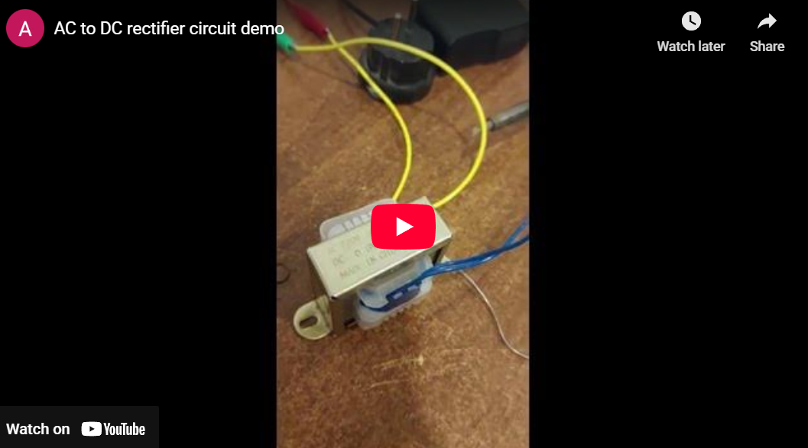
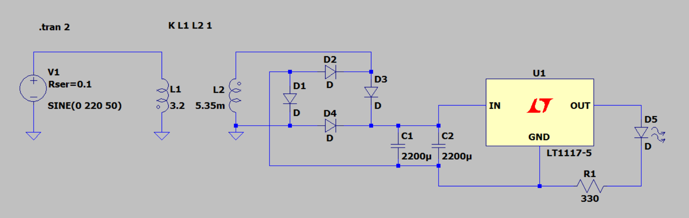
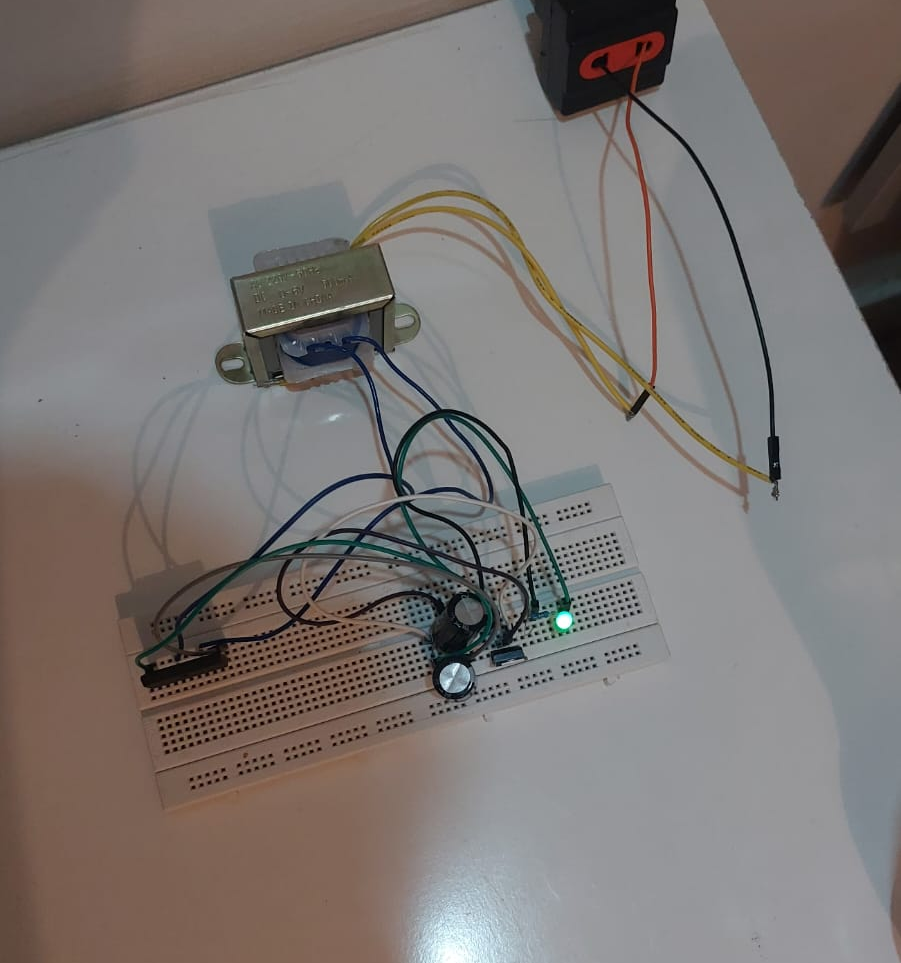
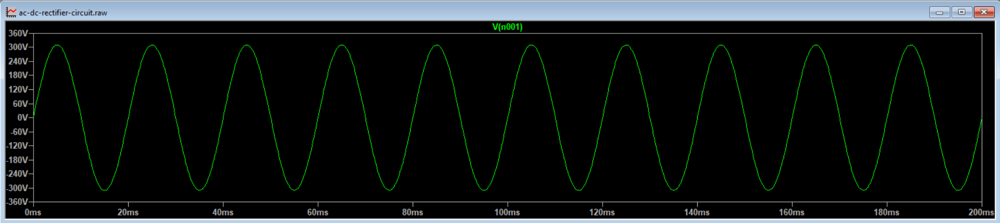
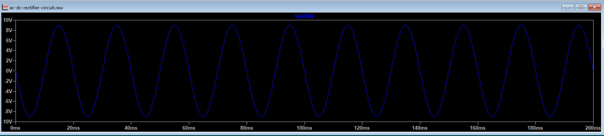
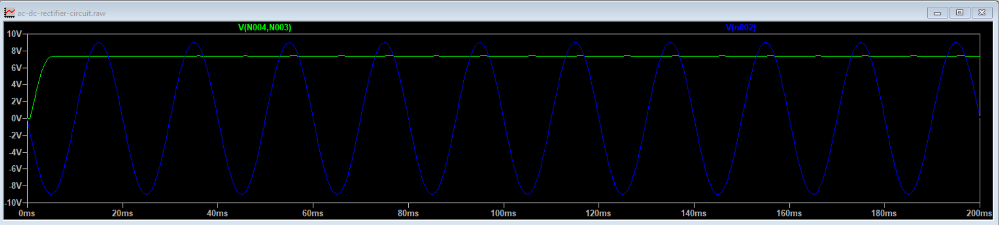
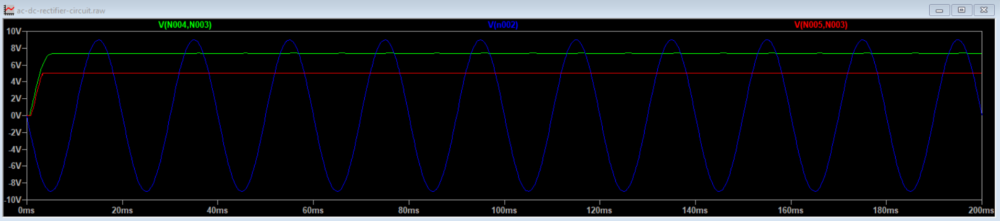

# AC to DC Rectifier Circuit ⚡🔌

A complete rectifier circuit design that converts 220V AC RMS (311V peak) mains voltage to a stable 5V DC output with less than 2% ripple. This project includes circuit design, simulation, theoretical calculations, and hardware implementation.

[](YOUR_YOUTUBE_LINK_HERE)

## 📋 Description

This project demonstrates the complete design and implementation of a rectifier circuit from concept to working hardware. The circuit successfully steps down 220V AC RMS to 5V DC while maintaining ripple voltage below the 2% threshold, making it suitable for powering low-voltage electronic devices.

<br>
<br>
<div align="center">
  <a href="YOUR_DOWNLOAD_LINK_HERE">
    
  </a>
</div>

## 🎯 Project Requirements

The circuit was designed to meet the following specifications:

1. **Rectify voltage from 220V AC RMS (311V peak) to 5V DC**
2. **Maintain ripple voltage < 2%**
3. **Provide stable output under varying load conditions**

## ✨ Features

- **Full-Wave Bridge Rectification**: Utilizes bridge rectifier for efficient AC to DC conversion
- **Voltage Regulation**: LM7805 linear regulator ensures stable 5V output
- **Low Ripple**: Large filter capacitors minimize voltage fluctuations
- **LED Indicator**: Visual confirmation of circuit operation
- **Safe Design**: Proper transformer isolation from mains voltage

## 🔧 Components Used

| Component | Specification | Quantity |
|-----------|--------------|----------|
| Transformer | 220V to 9V AC RMS, 50 Hz | 1 |
| Bridge Rectifier | Silicon Bridge (0.7V drop per diode) | 1 |
| Filter Capacitor | 2200 μF, 25V (Electrolytic) | 2 |
| Voltage Regulator | LM7805 (5V, 1A) | 1 |
| Current Limiting Resistor | 330 Ω | 1 |
| LED | Standard 5mm | 1 |

## 📐 Circuit Design

### Circuit Schematic



*Circuit designed and simulated in LTSpice*

### Hardware Implementation



*Completed circuit on breadboard*

## 📊 Complete Design Calculations

### Given Components:
- **Input Voltage**: 220V AC RMS (311V peak), 50 Hz
- **Transformer**: 220V to 9V AC RMS, 50 Hz
- **Bridge Rectifier**: 4 diodes in bridge configuration, silicon (0.7V drop each)
- **Capacitors**: 2 × 2200 μF (parallel → 4400 μF total)
- **Voltage Regulator**: LM7805
- **LED + Resistor**: 330 Ω
- **Load Currents**: 20 mA (LED test), 100 mA (moderate load)

---

## 🔌 Transformer Design & Implementation

### Transformer Turns Ratio Calculation

**Formula:**
```
V_secondary / V_primary = N_s / N_p
```

**Calculation:**
```
Turns Ratio = 9 / 220 ≈ 0.0409
N_s : N_p = 1 : 24.44 ≈ 1 : 25
```

**Explanation:** The transformer steps down voltage by a factor of ~24.4 from primary to secondary.

---

### LTSpice Transformer Implementation

For simulating an ideal transformer in LTSpice with perfect coupling:

**Inductance-Turns Relationship:**

The inductance of a coil is proportional to the square of the number of turns:
```
L ∝ N²
```

Therefore, the relationship between primary and secondary inductances is:
```
L2 / L1 = (N_s / N_p)²
```

or equivalently:
```
L2 = L1 × (N_s / N_p)²
```

**Explanation:** When the number of turns changes, the inductance changes by the square of that ratio. This is because inductance depends on both the magnetic flux (proportional to N) and the induced voltage (also proportional to N), giving an N² relationship.

---

**Step 1: Calculate Inductance Values**

For 50 Hz operation with reactance X_L ≈ 1 kΩ (to minimize loading):

**Primary Inductance (L1):**
```
X_L = 2πfL
L = X_L / (2πf)
L1 = 1000 / (2π × 50) ≈ 3.18 H
```

Use: **L1 = 3.2 H**

**Secondary Inductance (L2):**

Using the inductance-turns relationship:
```
L2 = L1 × (N_s/N_p)²
L2 = 3.2 × (0.0409)²
L2 = 3.2 × 0.001673
L2 ≈ 0.00535 H = 5.35 mH
```

Use: **L2 = 5.35 mH**

**Step 2: LTSpice Coupling Directive**

To create perfect coupling (k = 1) between inductors:
```
K L1 L2 1
```

**Step 3: Circuit Configuration**
```
Primary Side:
- AC Source: 220V RMS, 50 Hz
- Inductor L1: 3.2 H

Secondary Side:
- Inductor L2: 5.35 mH
- Load: Connected to bridge rectifier

Coupling: K L1 L2 1 (ideal coupling, no leakage)
```

**Voltage Waveform:**



*220V AC RMS (311V peak) mains voltage*

---

### Step 1 — Convert RMS to Peak Voltage (Secondary)

**Formula:**
```
V_peak = V_RMS × √2
```

**Calculation:**
```
V_peak = 9 × 1.41421356 ≈ 12.7279 V
```

**Explanation:** RMS voltage is the effective AC voltage; the peak is 1.414 × RMS.

**Voltage Waveform:**



*9V AC RMS after transformer (12.73V peak)*

---

### Step 2 — Diode Voltage Drop in Bridge

**Formula:**
```
V_drop(total) = 2 × V_D
```

**Calculation:**
```
V_drop(total) = 2 × 0.7 = 1.4 V
```

**Explanation:** Two diodes conduct in series at each half-cycle in a bridge rectifier.

---

### Step 3 — DC Peak After Rectifier

**Formula:**
```
V_DC,peak = V_peak - 2V_D
```

**Calculation:**
```
V_DC,peak = 12.7279 - 1.4 = 11.3279 V
```

**Explanation:** Maximum voltage the smoothing capacitor will reach.

**Voltage Waveform:**



*Full-wave rectified DC voltage (~11.33V peak)*

---

### Step 4 — Ripple Frequency

**Formula:**
```
f_ripple = 2 × f_mains
```

**Calculation:**
```
f_ripple = 2 × 50 = 100 Hz
```

**Time between recharges:**
```
T = 1/f_ripple = 1/100 = 0.01 s
```

**Explanation:** Full-wave rectifier doubles the AC mains frequency.

---

### Step 5 — Capacitor Ripple Voltage (Peak-to-Peak)

**Formula:**
```
ΔV_pp = I_load / (f_ripple × C)
```

**Capacitance:** C = 2 × 2200 μF = 4400 μF = 0.0044 F

**Example A — LED Load (20 mA):**
```
ΔV_pp = 0.02 / (100 × 0.0044)
ΔV_pp = 0.02 / 0.44 = 0.04545 V
```

**Example B — Moderate Load (100 mA):**
```
ΔV_pp = 0.1 / (100 × 0.0044)
ΔV_pp = 0.1 / 0.44 = 0.22727 V
```

**Explanation:** Peak-to-peak ripple is how much the capacitor voltage "falls" between AC peaks.

---

### Step 6 — Minimum Capacitor Voltage

**Formula:**
```
V_min = V_DC,peak - ΔV_pp
```

**LED 20 mA:**
```
V_min = 11.3279 - 0.04545 ≈ 11.2825 V
```

**100 mA Load:**
```
V_min = 11.3279 - 0.22727 ≈ 11.1006 V
```

**Explanation:** Lowest input voltage to LM7805; must be > 7V for proper regulation.

---

### Step 7 — Percent Ripple

**Formula:**
```
%_ripple = (ΔV_pp / V_DC,peak) × 100
```

**LED 20 mA:**
```
% = (0.04545 / 11.3279) × 100 ≈ 0.40%
```

**100 mA Load:**
```
% = (0.22727 / 11.3279) × 100 ≈ 2.01%
```

**Optional — Relative to Regulated 5V Output:**
```
%_5V = (ΔV_pp / 5) × 100
```

- LED 20 mA: (0.04545 / 5) × 100 ≈ **0.91%**
- 100 mA: (0.22727 / 5) × 100 ≈ **4.55%**

**Voltage Waveform:**



*Stable 5V DC output with minimal ripple*

---

### Step 8 — LED Current-Limiting Resistor

**Formula:**
```
R = (V_out - V_LED) / I_LED
```

**Assumptions:**
- V_out = 5V
- V_LED ≈ 2V
- I_LED ≈ 10 mA (0.01 A)

**Calculation:**
```
R = (5 - 2) / 0.01 = 3 / 0.01 = 300 Ω
```

**Standard Value Used:** **330 Ω**

---

## 🎥 Circuit Operation

### Voltage Transformation Stages

1. **AC Input (220V RMS / 311V peak)** → Transformer → **9V AC RMS (12.73V peak)**
2. **9V AC RMS** → Bridge Rectifier → **~11.3V DC (with ripple)**
3. **~11.3V DC** → Filter Capacitors → **~11.1V DC (smoothed)**
4. **~11.1V DC** → LM7805 Regulator → **5V DC (stable)**

## 📈 Performance Results

| Parameter | Specification | Achieved |
|-----------|--------------|----------|
| Input Voltage | 220V AC RMS | 220V AC RMS (311V peak) |
| Transformer Output | 9V AC RMS | 9V AC RMS (12.73V peak) |
| Output Voltage | 5V DC | 5V ± 0.05V |
| Ripple Voltage | < 2% | 0.40% (20mA), 2.01% (100mA) |
| Load Regulation | Good | Excellent |
| Temperature | Ambient | Regulator stays cool |

## 🛠️ Building the Circuit

### Required Tools

- Components listed above
- Breadboard
- Connecting wires

### Assembly Steps

1. **Safety First**: Disconnect from mains during assembly
2. **Transformer**: Connect 220V AC RMS primary (with proper insulation)
3. **Bridge Rectifier**: Connect AC input from transformer secondary
4. **Filter Capacitors**: Connect in parallel across DC output (mind polarity!)
5. **Voltage Regulator**: Wire LM7805 (Input → Capacitor, Output → Load)
6. **LED Circuit**: Add current-limiting resistor in series
7. **Testing**: Use multimeter to verify voltages at each stage

### Safety Precautions

⚠️ **WARNING**: This circuit involves mains voltage (220V AC RMS / 311V peak) which can be lethal!

- Always disconnect from mains before touching components
- Use proper insulation for all mains connections
- Ensure transformer is properly rated and insulated
- Use a fuse in the primary circuit
- Never work on live circuits
- Test with a current-limited power supply first if possible

## 📁 Project Files
```
ac-dc-rectifier-circuit/
│
├── LTspice/
│   └── ac-dc-rectifier-circuit.asc    # LTSpice schematic
│
├── images/
│   ├── circuit_design.png             # Circuit schematic
│   ├── voltage_initial.png            # Initial waveform
│   ├── voltage_transformer.png        # Transformer output
│   ├── voltage_bridge.png             # Bridge rectifier output
│   ├── voltage_final.png              # Final regulated output
│   ├── hardware_circuit.png           # Implemented circuit
│   └── youtube_window_1.png           # Demo video thumbnail
│
└── README.md
```

## 🎓 Learning Outcomes

This project demonstrates:

1. **Power Supply Design**: Complete AC to DC conversion process
2. **Transformer Design**: Turns ratio calculation and inductance relationships
3. **Component Selection**: Choosing appropriate components for specifications
4. **Circuit Simulation**: Using LTSpice for circuit analysis
5. **Practical Implementation**: Building and testing real circuits
6. **Safety Awareness**: Working with mains voltage safely
7. **Mathematical Analysis**: Theoretical calculations and verification

## 🔄 Potential Improvements

- Add heat sink to LM7805 for higher current loads
- Implement short-circuit protection
- Add input/output filter capacitors near regulator
- Use switch-mode power supply for better efficiency
- Add fuse protection on primary side
- Include output terminals for easy connection

## 🤝 Contributing

Improvements and suggestions are welcome! Feel free to:

- Suggest more efficient components
- Improve the circuit design
- Add safety features
- Enhance documentation
- Share test results

## 📄 License

This project is licensed under the MIT License - see the [LICENSE](LICENSE) file for details.

## 🙏 Acknowledgments

- Circuit design concepts from power electronics fundamentals
- LTSpice for circuit simulation
- Component datasheets from manufacturers


<br>
<div align="center">
  <a href="YOUR_DOWNLOAD_LINK_HERE">
    
  </a>
</div>

## <!-- CONTACT -->

<!-- END CONTACT -->

## **Experience the power of efficient voltage conversion! ⚡✨**
